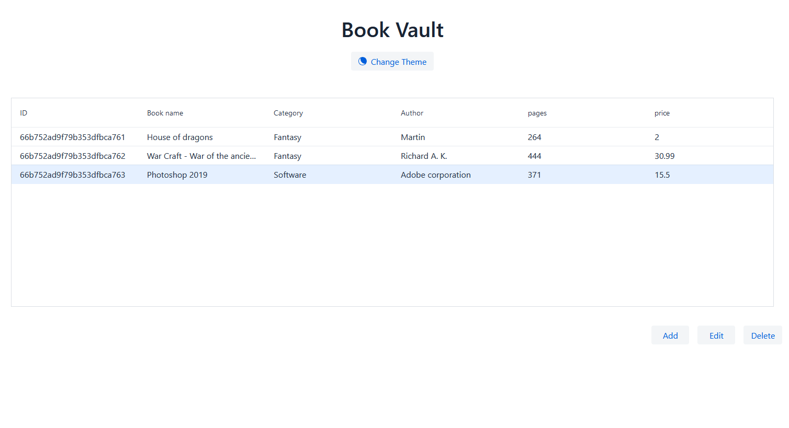
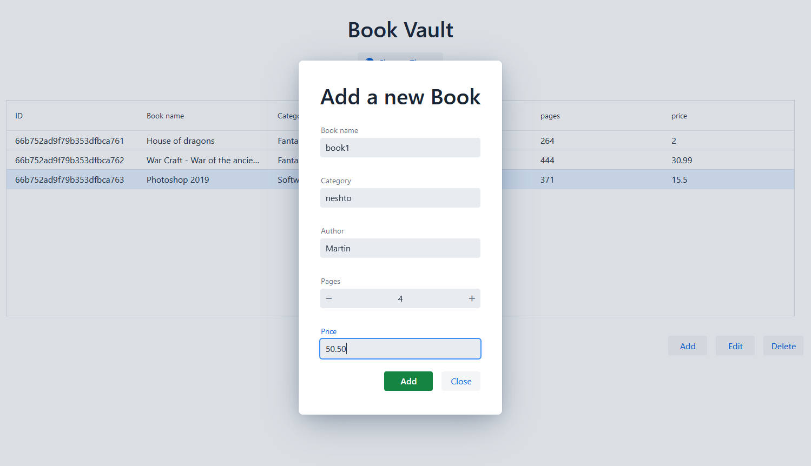
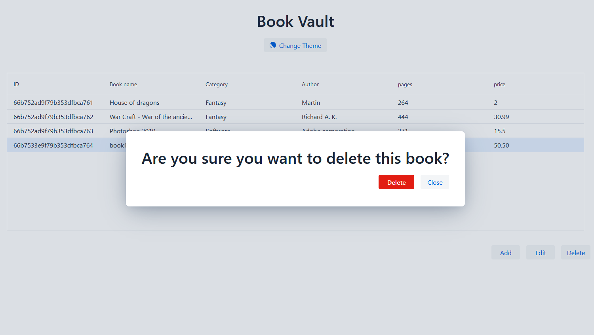

# This is book vault application with CRUD functionalities

It uses asynchronous web client and document based database.

New Java frontend template is added to the project which uses React under the hood (Vaadin Flow)

## Tools

**Software:** Spring, Java 21, WebFlux, Spring cache, Spring containers, Lombok, Awaitility, Mapstruct, Vaadin Flow (UI Framework), Logbook, Postman

**Database:** MongoDB (on locale machine)

## Setup datasource from Docker (Optional)

```bash
docker compose -f docker_mongodb.yml up -d
```

Access datasource from the browser with following credentials:
- URL: http://localhost:8081
- Username: `admin`
- Password: `password`


## Available tests

<b>Service test:</b> /src/test/java/com/martinatanasov/reactivemongo/service/BookServiceTest.java

<b>Service test with Spring container:</b> /src/test/java/com/martinatanasov/reactivemongo/service/BookServiceContainerTest.java

<b>Controller test via WebTestClient:</b> /src/test/java/com/martinatanasov/reactivemongo/controller/BookControllerTest.java

<b>Postman collection:</b> /postman/spring-reactive-mongo-books.postman_collection.json

## Endpoints

**From BookController:** <a href="http://localhost:5000/api/v1/books/all-books">http://localhost:5000/api/v1/books/</a>
You could use postman collection in folder 'postman'.

**From Vaadin Flow (Experimental UI):** <a href="http://localhost:5000/vaadin">http://localhost:5000/vaadin</a>

## Testing

1. Via Postman's collection
2. Via Maven test

```bash
mvn test
```

## Build production project

```bash
mvn clean package -Pproduction
```

> [!CAUTION]
> The script will also generate frontend. This process could take some minutes!

## Vaadin UI

<table>
    <tr>
        <td></td>
    </tr>
    <tr>
        <td></td>
    </tr>
    <tr>
        <td></td>
    </tr>
</table>

## Contact me

[](https://github.com/balantaim)
[](https://play.google.com/store/apps/dev?id=4991626043223074729)
[](https://www.linkedin.com/in/martin-atanasov-47550b1a2/)