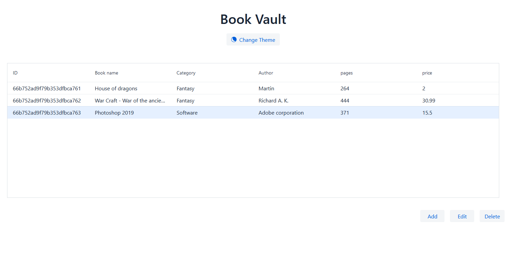
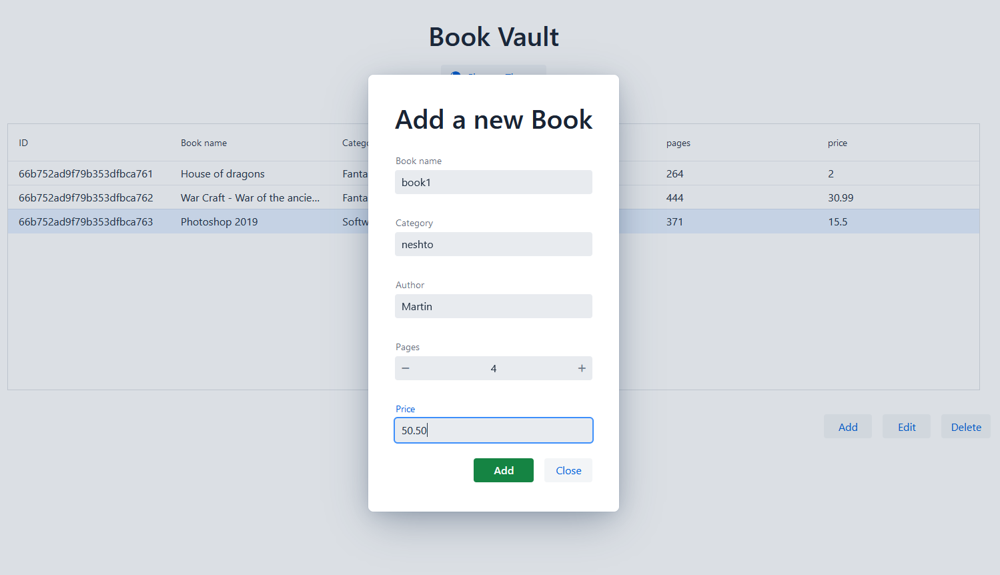
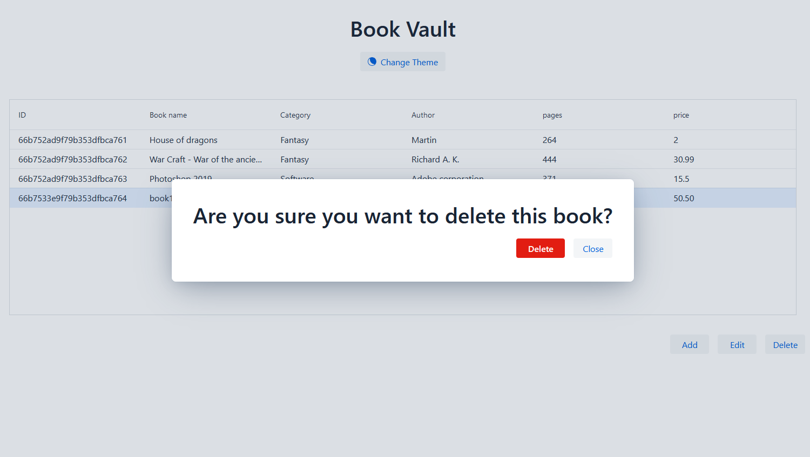

# This is book vault application with CRUD functionalities

### It uses asynchronous web client and document based database.

### New Java frontend template is added to the project which uses React under the hood (Vaadin Flow)

## Tools

Software: Spring, Java 21, WebFlux, Spring cache, Spring containers, Lombok, Awaitility, Mapstruct, Vaadin Flow (UI Framework), Logbook, Postman

Database: MongoDB (on locale machine)

## Available tests

<b>Service test:</b> /src/test/java/com/martinatanasov/reactivemongo/service/BookServiceTest.java

<b>Service test with Spring container:</b> /src/test/java/com/martinatanasov/reactivemongo/service/BookServiceContainerTest.java

<b>Controller test via WebTestClient:</b> /src/test/java/com/martinatanasov/reactivemongo/controller/BookControllerTest.java

<b>Postman collection:</b> /postman/spring-reactive-mongo-books.postman_collection.json

## Endpoints

From BookController: <a href="http://localhost:5000/api/v1/books/all-books">http://localhost:5000/api/v1/books/</a>
You could use postman collection in folder 'postman'.

From Vaadin Flow (Experimental UI): <a href="http://localhost:5000/vaadin">http://localhost:5000/vaadin</a>

## Build production project

mvn clean package -Pproduction

The script will also generate frontend. This process could take some minutes!

## Vaadin UI

<table>
    <tr>
        <td></td>
    </tr>
    <tr>
        <td></td>
    </tr>
    <tr>
        <td></td>
    </tr>
</table>